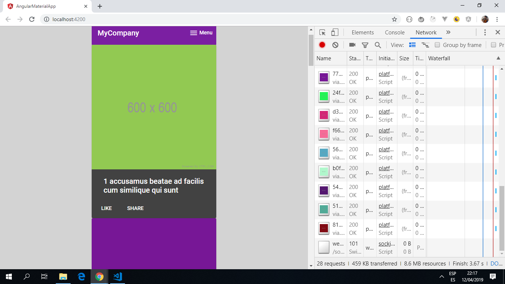
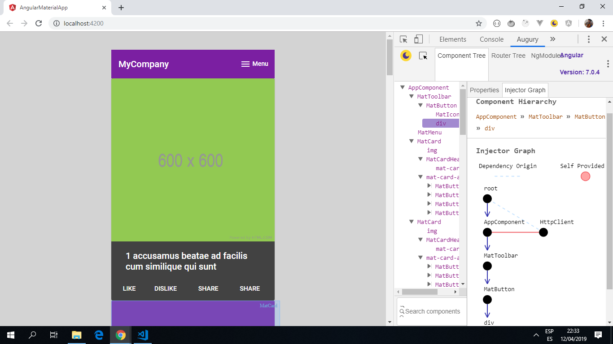

# Angular Material App

This app integrates Google's Material Design into an Angular 9 app. It displays a series of coloured cards from a public API. The number of cards is limited to 10 using a splice function, but there are 500 of these cards available, all with titles, numbers etc.

*** Note: to open web links in a new window use: _ctrl+click on link_**

## Table of contents

* [Angular Material App](#angular-material-app)
  * [Table of contents](#table-of-contents)
  * [General info](#general-info)
  * [Screenshots](#screenshots)
  * [Technologies](#technologies)
  * [Setup](#setup)
  * [Code Examples](#code-examples)
  * [Features](#features)
  * [Status & To-Do List](#status--to-do-list)
  * [Inspiration](#inspiration)
  * [Contact](#contact)

## General info

* A Gary Simon tutorial was followed (based on Angular 4) but the app.module.ts, app.component.ts and app.component.html required changes due to changes in Angular 7/8. Update to Angular 9 did not need any chhanges to the code.
* Materials modules begin with 'mat' and not 'md'; md has been deprecated.
* The map function/Angular module (and related pipe function) were not required. The data defaults to json format and a simpler code worked.
* [A jsonplaceholder API](https://jsonplaceholder.typicode.com/photos) was used to provide dummy json data for the app.

## Screenshots

.
.

## Technologies

* [Angular v9.1.0](https://angular.io/)
* [RxJS Library v6.5.4](https://angular.io/guide/rx-library) used to handle datastreams and propagation of change using observables.
* [Angular Material v9.1.0](https://material.angular.io/).

## Setup


* install save-dev @angular-devkit/build-angular
* Install dependencies using `npm i`
* Run `ng serve` for a dev server
* Navigate to `http://localhost:4200/`. The app will automatically reload if you change any of the source files

## Code Examples

```typescript
import { Component } from '@angular/core';
import { HttpClient } from '@angular/common/http';
// import { map } from "rxjs/operators";

@Component({
  selector: 'app-root',
  templateUrl: './app.component.html',
  styleUrls: ['./app.component.css']
})

export class AppComponent {
  myData: any;

  constructor(private http: HttpClient) {

    this.http.get('https://jsonplaceholder.typicode.com/photos')
      .subscribe(
        data => {
          this.myData = data;
          console.log(data);
        },
        error => {
          alert('ERROR');
        });
  }
}

```

## Features

* Angular Material cards used to show api data.
* Updated to use latest Angular 9.

## Status & To-Do List

* Status: Working.
* To-Do: add functionality.

## Inspiration

* [original Angular 4 Material Tutorial by Gary Simon](https://coursetro.com/posts/code/67/Angular-4-Material-Tutorial).

## Contact

Repo created by [ABateman](https://www.andrewbateman.org) - feel free to contact me!
