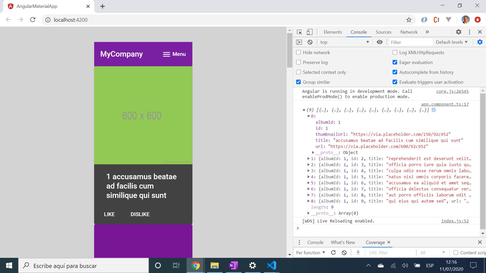

# :zap: Angular Material App

This app integrates Google's Material Design into an Angular app. It displays a series of coloured cards from a public API. The number of cards is limited to 10 using a splice function, but there are 500 of these cards available, all with titles, numbers etc.
* **Note:** to open web links in a new window use: _ctrl+click on link_


## :page_facing_up: Table of contents

* [:zap: Angular Material App](#zap-angular-material-app)
  * [:page_facing_up: Table of contents](#page_facing_up-table-of-contents)
  * [:books: General info](#books-general-info)
  * [:camera: Screenshots](#camera-screenshots)
  * [:signal_strength: Technologies](#signal_strength-technologies)
  * [:floppy_disk: Setup](#floppy_disk-setup)
  * [:computer: Code Examples](#computer-code-examples)
  * [:cool: Features](#cool-features)
  * [:clipboard: Status & To-Do List](#clipboard-status--to-do-list)
  * [:clap: Inspiration](#clap-inspiration)
  * [:file_folder: License](#file_folder-license)
  * [:envelope: Contact](#envelope-contact)

## :books: General info

* A Gary Simon tutorial was followed (based on Angular 4) but the app.module.ts, app.component.ts and app.component.html required changes due to changes in Angular 7/8.
* Http request moved to its own service file.
* Materials modules begin with 'mat' and not 'md'; md has been deprecated.
* rxjs pipe - map - filter used to limit http response to 10 items using item id - max 5000 items available which takes a while to download.
* rxjs throwError method updated
* [A jsonplaceholder API](https://jsonplaceholder.typicode.com/photos) was used to provide dummy json data for the app.

## :camera: Screenshots

.
.

## :signal_strength: Technologies

* [Angular v13](https://angular.io/)
* [RxJS Library v7](https://angular.io/guide/rx-library) used to handle datastreams and propagation of change using observables.
* [Angular Material v13](https://material.angular.io/).

## :floppy_disk: Setup

* Install dependencies using `npm i`
* Run `ng serve` for a dev server
* Navigate to `http://localhost:4200/`. The app will automatically reload if you change any of the source files

## :computer: Code Examples

* service function to get profile data via http request

```typescript
export class ProfileService {
  constructor(private http: HttpClient) {}

  getProfileData(): Observable<Profile> {
    const profileUrl = "https://jsonplaceholder.typicode.com/photos";
    return this.http.get<Profile>(profileUrl).pipe(
      map((data: Profile) => data),
      catchError((err) => {
        return throwError(
          "Problem fetching profile data from API, error: ",
          err
        );
      })
    );
  }
}
```

## :cool: Features

* Angular Material cards used to show api data.

## :clipboard: Status & To-Do List

* Status: Working.
* To-Do: Nothing.

## :clap: Inspiration

* [original Angular 4 Material Tutorial by Gary Simon](https://coursetro.com/posts/code/67/Angular-4-Material-Tutorial).

## :file_folder: License

* This project is licensed under the terms of the MIT license.

## :envelope: Contact

* Repo created by [ABateman](https://github.com/AndrewJBateman), email: gomezbateman@yahoo.com
